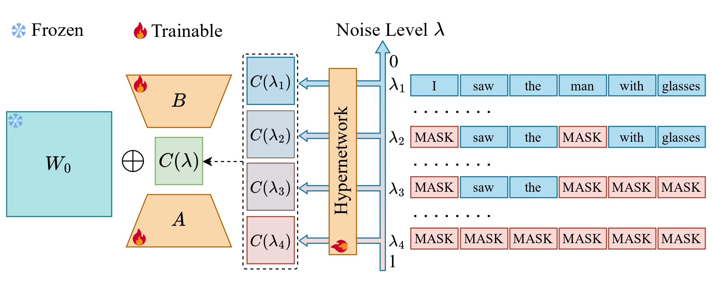

# NARA: Noise-Aware Rank Adaptation for Diffusion Language Models

Official implementation of NARA, a parameter-efficient fine-tuning (PEFT) method for diffusion-based language models (dLLMs).

Standard PEFT methods such as LoRA employ static weight updates that are agnostic to the noise level, making them suboptimal for dLLMs. In masked diffusion models (e.g., LLaDA), the denoising trajectory spans noise levels from fully masked ($\lambda=1$) to nearly clean ($\lambda \approx 0$), causing significant shifts in input distribution and reconstruction difficulty. A fixed adapter cannot optimally handle this entire range.

NARA addresses this by inserting a dynamic core matrix $\mathbf{C}(\lambda)$ between two static low-rank projection matrices, where $\mathbf{C}(\lambda)$ is generated on-the-fly by a lightweight, **globally shared hypernetwork** conditioned on the current noise level $\lambda$:

$$\mathbf{h} = \mathbf{W}_0 \mathbf{x} + \mathbf{B}\,\mathbf{C}(\lambda)\,\mathbf{A}\,\mathbf{x}$$

$$\mathbf{C}(\lambda) = \mathbf{I}_r + \eta \cdot \mathcal{F}_\phi(\mathbf{e}_\lambda)$$

Here $\mathbf{A}$ and $\mathbf{B}$ are static trainable matrices (as in standard LoRA), $\phi$ is an MLP hypernetwork, and $\mathbf{e}$ is a Gaussian Fourier embedding of $\lambda$. The hypernetwork is shared across all layers and modules, so $\mathbf{C}(\lambda)$ is computed once per denoising step and broadcast to all adapter layers, keeping parameter and latency overhead negligible. At initialization, the last layer of $\mathcal{F}_\phi$ is zeroed so that $\mathbf{C}(\lambda) = \mathbf{I}_r$ and NARA reduces to standard LoRA, ensuring training stability.

<div align="center">
  
</div>

## Installation

```bash
pip install -r requirements.txt
```

## Data Preparation

### Math datasets (math14k)
Download from [LLM-Adapters ft-training_set](https://github.com/AGI-Edgerunners/LLM-Adapters/tree/main/ft-training_set) and place under `data/llm_adapt/math/`.

Required file: `data/llm_adapt/math/math_14k.json`

### Commonsense datasets (commonsense170k + evaluation sets)
Download from [LLM-Adapters dataset](https://github.com/AGI-Edgerunners/LLM-Adapters/tree/main/dataset) and place the corresponding folders under `data/llm_adapt/`.

Required files:
- `data/llm_adapt/commonsense_170k/train.json`
- Evaluation sets: `ARC-Challenge/`, `ARC-Easy/`, `boolq/`, `hellaswag/`, `openbookqa/`, `piqa/`, `social_i_qa/`, `winogrande/`

### Code dataset (code_feedback)
Requires a Hugging Face token. Get yours at https://huggingface.co/settings/tokens, then:

```bash
HF_TOKEN=your_token bash data/download_code_feedback.sh
```

## Training

Single GPU:
```bash
python train.py --config config/nara/llada_instruct_nara_math14k.yaml --seed 1234
```

Available configs:
| Task | Config |
|------|--------|
| Math (math14k) | `config/nara/llada_instruct_nara_math14k.yaml` |
| Commonsense (170k) | `config/nara/llada_instruct_nara_commonsense170k.yaml` |
| Code (code_feedback) | `config/nara/llada_instruct_nara_code_feedback.yaml` |

### Optional innovation: Noise-Continuity Regularization

NARA learns a dynamic core matrix `C(lambda)` for each denoising noise level. To make this trajectory smoother, this repo also includes an optional **Noise-Continuity Regularization** term:

```text
|| C(lambda + delta) - C(lambda) ||_F^2
```

It encourages adjacent denoising states to use compatible adapter transformations, which is especially useful for diffusion language models where generation moves through many nearby noise levels. Run the math config with this regularizer enabled:

```bash
python train.py --config config/nara/llada_instruct_nara_math14k_csmooth.yaml --seed 1234
```

### Fork-LIFT NaRA

Fork-LIFT NaRA combines two diffusion-LLM training signals:

- LIFT-style learnability: low-noise steps emphasize hard tokens, high-noise steps emphasize easy tokens.
- Flexibility-Trap-style fork awareness: high-entropy masked tokens receive larger loss weight because they are more likely to correspond to reasoning branch points.

Run the freeze-mid smoke config:

```bash
python train.py --config config/nara/smoke_nara_fork_lift_freeze_mid.yaml --seed 1234
```

Run the split math14k config:

```bash
python train.py --config config/nara/math14k_split_fork_lift_freeze_mid.yaml --seed 1234
```

## Evaluation

Install evaluation dependencies:
```bash
pip install transformers==4.49.0 lm_eval==0.4.8 accelerate==0.34.2
pip install antlr4-python3-runtime==4.11 math_verify sympy hf_xet
export HF_ALLOW_CODE_EVAL=1
export HF_DATASETS_TRUST_REMOTE_CODE=true
```

Example: evaluate on GSM8K (math task checkpoint):
```bash
CUDA_VISIBLE_DEVICES=0 accelerate launch --main_process_port 29500 --num_processes 1 \
    eval_llada.py \
    --tasks gsm8k --num_fewshot 0 \
    --model llada_dist_peft \
    --model_args base_model_name='llada_instruct',peft_name='nara',ft_task='math14k',run_time=1,gen_length=256,steps=256,block_length=8 \
    --log_samples --output_path eval/results/gsm8k/output.json
```

## Base Model

NARA is built on [LLaDA-8B-Instruct](https://huggingface.co/GSAI-ML/LLaDA-8B-Instruct), which will be downloaded automatically from Hugging Face on first use.

## Citation

```bibtex
@inproceedings{nara2026,
  title={Na{RA}: Noise-Aware Lo{RA} for Parameter-Efficient Fine-Tuning of Diffusion {LLM}s},
  author={Shuaidi Wang and Zhan Zhuang and Ruping Huang and Yu Zhang},
  year={2026},
  booktitle={Forty-third International Conference on Machine Learning},
  year={2026},
  url={https://openreview.net/forum?id=s8UGIRF38a}
}
```
